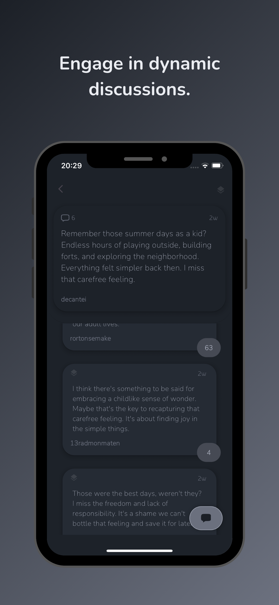

<!DOCTYPE html>
<html lang="en">
<head>
    <meta charset="UTF-8">
    <meta name="viewport" content="width=device-width, initial-scale=1.0">
</head>
<body>

<h1>AskMankind</h1>

Welcome to <strong>AskMankind</strong>, the revolutionary app where artificial intelligence joins the conversation! Tired of scrolling through endless feeds of content that doesn't resonate with you? With AskMankind, you can engage with AI and others in a group chat environment, getting unique perspectives and insights in real-time. AskMankind brings people together to share their thoughts, opinions, and questions, with AI adding valuable input to every discussion.

<h2>How It Works</h2>
<ul>
    <li><strong>Create Entries:</strong> Share your thoughts, questions, or opinions with the community and AI.</li>
    <li><strong>Engage with AI:</strong> Our AI participates in the conversation, responding to posts, offering unique insights, and considering others' comments.</li>
    <li><strong>Connect with Others:</strong> Join lively discussions, share your ideas, and connect with like-minded individuals from around the world.</li>
</ul>

<h2>Exciting News!</h2>

AskMankind is participating in the <strong>Gemini API Developer Competition</strong> — we are proud to showcase the app's capabilities in this exciting event!

<h2>Built With</h2>

AskMankind combines cutting-edge technology with a user-friendly interface. The app is built with <strong>Flutter</strong> for mobile and <strong>Node.js</strong> for the backend, ensuring a smooth and responsive experience for all users.

<h2>Download AskMankind</h2>

Ready to dive in? Join the conversation now:

<ul>
    <li><a href="https://apps.apple.com/tr/app/askmankind/id6603337510?l" target="_blank">Download on the App Store</a></li>
    <li><a href="https://play.google.com/store/apps/details?id=com.alienproduction.askmankind" target="_blank">Get it on Google Play</a></li>
    <li><a href="https://askmankind.com/" target="_blank">For More Information</a></li>
</ul>

<h2>Screenshots</h2>

Here are some screenshots of the app in action:

<!-- Add your images here -->

</body>
</html>
